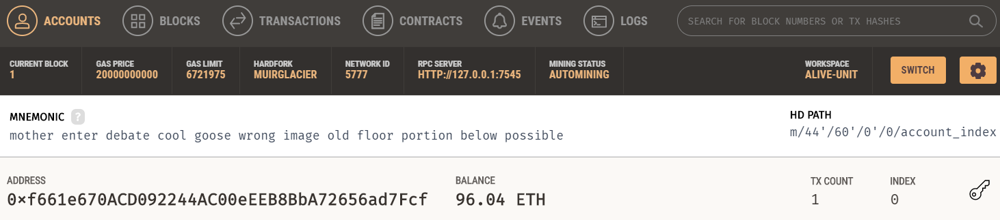
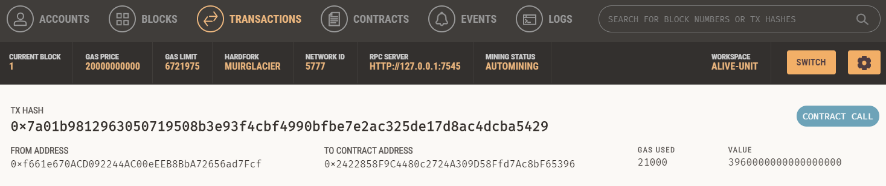
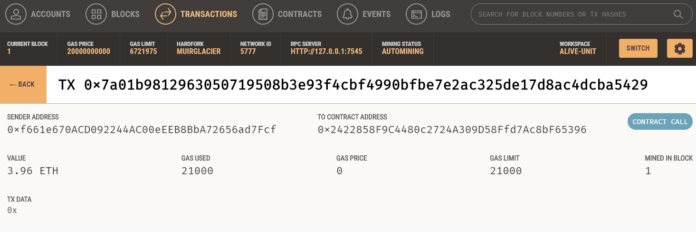

# Crypto Wallet Demo

This python application is a demo on utilising a cryptocurrency wallet to make transactions. The program uses streamlit as a frontend, and you can run it with >streamlit run fintech_finder.py

---

The program is designed to work with a Ganache instance which simulates a crypto currency wallet. After downloading the application and running a quickstart environment, you can see the default senders account on the first entry as seen below

You will need to create or edit an environment file to include a "MNEMONIC" with the provided mnemonic from Ganache

---

When running Streamlit, it will automatically pull the account details from the Ganache instance. You can select a professional to hire on the sidebar, as well as how many hours you want to hire them for. After pressing send transaction, you should be able to see the transaction on ganache as seen below

---

You can also check the receivers details by clicking the 'to contract address'

